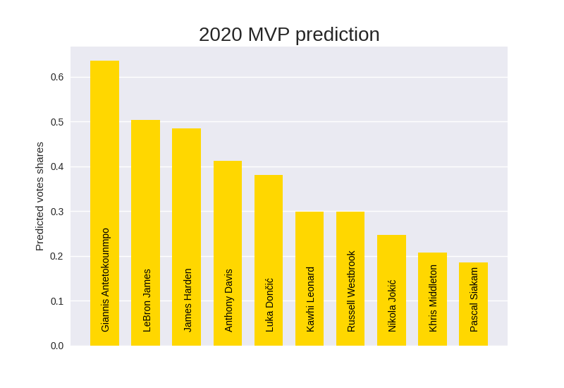

# NBA MVP results

## Python files
1. `predict.py` predict the 2019-2020 MVP using `current_data.csv` and `historical_data.csv` and save the result graph and all the others graph (see [Data](#data)).
2. `predict_old_mvps.py` tries to predict every years MVPs without knowing who it was from 1979-1980 to 2018-2019

## Model
I choose to use a basic linear regression model.
I tried to predict the vote shares of the bests players for this year.
The model has been tested with old MVP, by removing one year of the training data and using it has a test data.
The model predicted 27 good MVPs on a 40 years span

## Data
The data has been taken from [basketball-reference](basketball-reference.com) from games between the begigining of the regular season (octobre 18th 2019) and the last day before the hiatus (march 11th 2020) for the 2019-2020 season.\
The training data starts at the 1979-1980 season.
As I used a linear regression model, I didn't take into account advanced stats as they are co-dependent. Therefore here are the used data (for each of those stats you can see how it has effect the vote shares for every year in the graph directory):
- Points per game ([graph](graphs/PTS.png))
- Assists per game ([graph](graphs/AST.png))
- Rebounds per game ([graph](graphs/TRB.png))
- Blocks per game ([graph](graphs/BLK.png))
- Steals per game ([graph](graphs/STL.png))
- Field goal percentage ([graph](graphs/FG%.png))
- Free throws percentage ([graph](graphs/FT%.png))
- Win percentage ([graph](graphs/win_perc.png))
- Minutes played per game ([graph](graphs/MP.png))
- Game played this year ([graph](graphs/G.png))

## 2019-2020
The 2019-2020 NBA season has been shut down for multiple month and restarted for only 22 teams with 8 regular games followed by the playoffs. Therefore the NBA decided not to include those 8 games to vote for any of this year award.

### Results

## 1979-1980 to 2018-2019
Here are the results for the year where the model had an error.\
- In 1981-1982 Moses Malone would not be the mvp but Larry Bird would be
- In 1988-1989 Magic Johnson would not be the mvp but Michael Jordan would be
- In 1989-1990 Magic Johnson would not be the mvp but Michael Jordan would be
- In 1992-1993 Charles Barkley would not be the mvp but Hakeem Olajuwon would be
- In 1993-1994 Hakeem Olajuwon would not be the mvp but David Robinson would be
- In 1996-1997 Karl Malone would not be the mvp but Michael Jordan would be
- In 1997-1998 Michael Jordan would not be the mvp but Karl Malone would be
- In 2000-2001 Allen Iverson would not be the mvp but Shaquille O'Neal would be
- In 2004-2005 Steve Nash would not be the mvp but Dirk Nowitzki would be
- In 2005-2006 Steve Nash would not be the mvp but LeBron James would be
- In 2010-2011 Derrick Rose would not be the mvp but LeBron James would be
- In 2016-2017 Russell Westbrook would not be the mvp but James Harden would be
- In 2018-2019 Giannis Antetokounmpo would not be the mvp but James Harden would be
